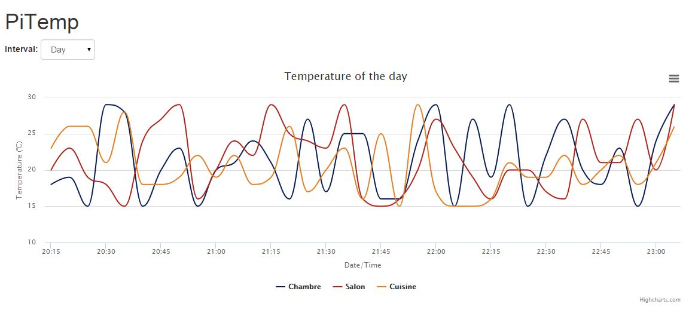

# PiTemp

Lite Node JS project to create temperature charts from DS18B20 sensors.

This project uses RRD Tool, Highcharts, Bootstrap and JQuery framework.



## Configuration file

Modify the `config.js` file in order to change the configuration:

```javascript
var config = module.exports = {};

config.http = {};
// Port of web interface (Warning: Port below 1024 can only start by root user)
config.http.port = 8080;

// Path of the .rrd file
config.filename = 'PiTemp.rrd';

// 1-wire sensors list
config.w1 = [{
  // Uniq id in used to store data in rrd file
  id: '28-0000054c2ec2',
  // Path to retrieve sensor values
  path: '/sys/bus/w1/devices/28-00042c32c1ff/w1_slave',
  // Name of the sensor (show in chart)
  name: 'Chambre',
  // Color of the line in the chart
  color: '#081D58'
}, {
  id: '28-00042c32c1aa',
  path: '/sys/bus/w1/devices/28-00042c32c1aa/w1_slave',
  name: 'Salon',
  color: '#B1221C'
}];

module.exports = config;
```

## Launch web server

To launch the web server use the command:
```shell
node server.js
```
or
```shell
npm start
```

The server will be started on the port specified in the configuration file.

## More information
[Code4Pi Website (in French)](https://code4pi.fr/2015/11/suivi-de-temperature-raspberry-pi-sonde-1-wire-ds18b20/)